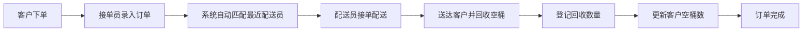

## 1. 产品概述

桶装水配送站管理系统，帮助水站高效管理客户、订单、配送员和水桶资产，实现从接单到配送再到空桶回收的全流程数字化管理。

- 解决传统水站手工记账混乱、派单效率低、水桶资产流失、对账困难等问题
- 目标用户：水站经营者、接单员、配送员、财务人员

## 2. 核心功能

### 2.1 用户角色
| 角色 | 注册方式 | 核心权限 |
|------|----------|----------|
| 管理员 | 系统初始化 | 全部功能管理、数据统计、系统配置 |
| 接单员 | 管理员创建 | 客户管理、订单录入、订单查询 |
| 配送员 | 管理员创建 | 查看派单、确认配送、登记空桶回收 |
| 财务 | 管理员创建 | 每日对账、资产盘点、报表查看 |

### 2.2 功能模块
1. **工作台首页**：今日数据概览、待办事项、快速操作
2. **客户档案管理**：客户信息增删改查、地址/楼层/常订品牌/空桶数管理
3. **订单管理**：订单录入、品牌/数量/配送时间窗口选择、订单状态跟踪
4. **配送管理**：配送员管理、自动派单、手动调整派单
5. **空桶回收**：回收登记、客户空桶数更新
6. **水桶资产**：资产盘点、出入库登记、库存管理
7. **对账中心**：每日空桶回收与送出数量对账、差异处理

### 2.3 页面详情
| 页面名称 | 模块名称 | 功能描述 |
|---------|---------|----------|
| 工作台 | 数据概览 | 今日订单数、配送中订单、待回收空桶、营业额统计 |
| 工作台 | 待办提醒 | 待派单、待配送、待回收空桶提醒 |
| 工作台 | 快速操作 | 快速开单、快速登记回收 |
| 客户管理 | 客户列表 | 分页查询、搜索筛选、客户卡片展示 |
| 客户管理 | 客户详情 | 基本信息、地址管理、常订品牌、历史空桶数、订单记录 |
| 客户管理 | 客户表单 | 新增/编辑客户信息（姓名、电话、地址、楼层、常订品牌、初始空桶数） |
| 订单管理 | 订单列表 | 按状态筛选、时间筛选、搜索订单 |
| 订单管理 | 订单录入 | 选择客户、选择品牌、输入数量、选择配送时间窗口 |
| 订单管理 | 订单详情 | 订单信息、配送状态、支付状态、操作日志 |
| 配送管理 | 配送员列表 | 配送员信息、在线状态、今日配送量 |
| 配送管理 | 自动派单 | 新订单自动匹配最近空闲配送员 |
| 配送管理 | 派单调整 | 手动调整订单分配的配送员 |
| 空桶回收 | 回收登记 | 选择客户、输入回收数量、关联订单、更新客户空桶数 |
| 空桶回收 | 回收记录 | 回收历史查询、筛选 |
| 水桶资产 | 品牌库存 | 各品牌空桶/满桶库存统计 |
| 水桶资产 | 出入库登记 | 采购入库、报废登记、调拨记录 |
| 水桶资产 | 资产盘点 | 盘点单创建、实盘录入、差异分析 |
| 对账中心 | 每日对账 | 自动统计当日送出桶数、回收桶数、差异计算 |
| 对账中心 | 对账历史 | 历史对账记录查询、差异处理记录 |

## 3. 核心流程

### 3.1 订单流程
客户来电/微信下单 → 接单员录入系统 → 系统自动匹配最近配送员 → 配送员接单 → 配送上门 → 客户确认收货 → 登记空桶回收 → 订单完成

### 3.2 自动派单逻辑
新订单创建 → 获取客户地址坐标 → 查询3公里内空闲配送员 → 按距离排序 → 分配给最近配送员 → 通知配送员

### 3.3 每日对账流程
每日0点自动生成对账表 → 统计当日送出满桶总数 → 统计当日回收空桶总数 → 计算理论库存变化 → 对比实际库存 → 生成差异报告 → 人工确认处理

## 4. 用户界面设计

### 4.1 设计风格
- **主色调**：深蓝色 (#1E40AF) - 代表专业、可靠、水的属性
- **辅助色**：天蓝色 (#38BDF8) - 用于高亮、按钮、状态标识
- **成功色**：绿色 (#22C55E) - 已完成、正常状态
- **警告色**：橙色 (#F97316) - 待处理、异常状态
- **危险色**：红色 (#EF4444) - 取消、错误状态
- **背景色**：浅灰蓝 (#F0F9FF) - 整体背景，营造清爽感
- **卡片背景**：白色 (#FFFFFF) - 内容区域
- **字体**：主字体使用思源黑体，数字使用等宽字体增强可读性

**按钮风格**：圆角8px，微阴影，悬停时轻微上浮效果
**卡片风格**：圆角12px，柔和阴影，悬停时阴影加深
**布局风格**：左侧导航 + 顶部面包屑 + 右侧内容区的经典管理后台布局

### 4.2 页面设计概述
| 页面名称 | 模块名称 | UI元素 |
|---------|---------|--------|
| 工作台 | 数据概览 | 4个统计卡片（今日订单、配送中、待回收、营业额），带图标和趋势箭头 |
| 工作台 | 待办列表 | 列表形式展示待派单、待配送订单，带快捷操作按钮 |
| 客户管理 | 客户列表 | 表格展示，支持筛选、搜索，每行带快捷操作 |
| 客户管理 | 客户表单 | 分组表单，基本信息、地址信息、配送偏好分组展示 |
| 订单管理 | 订单录入 | 分步表单，先选客户再选商品最后确认，支持快速录入 |
| 配送管理 | 派单面板 | 左右分栏，左侧订单池右侧配送员列表，支持拖拽分配 |
| 对账中心 | 每日对账 | 数据看板，对比送出/回收/差异，图表可视化 |

### 4.3 响应式
- **桌面优先**设计，针对1920x1080分辨率优化
- **平板适配**：1024px以上，左侧导航可折叠
- **移动适配**：768px以下，底部Tab导航，简化操作
- **触控优化**：按钮最小高度44px，关键操作区域放大

### 4.4 数据可视化
- 使用 Recharts 图表库
- 每日配送量趋势图（折线图）
- 品牌销量占比（饼图）
- 配送员业绩排名（柱状图）
- 空桶回收率仪表盘
