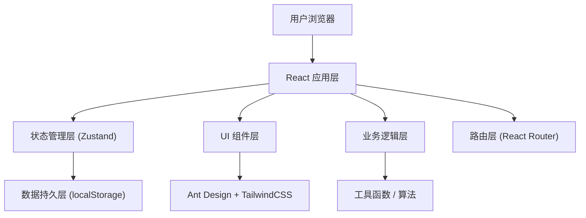
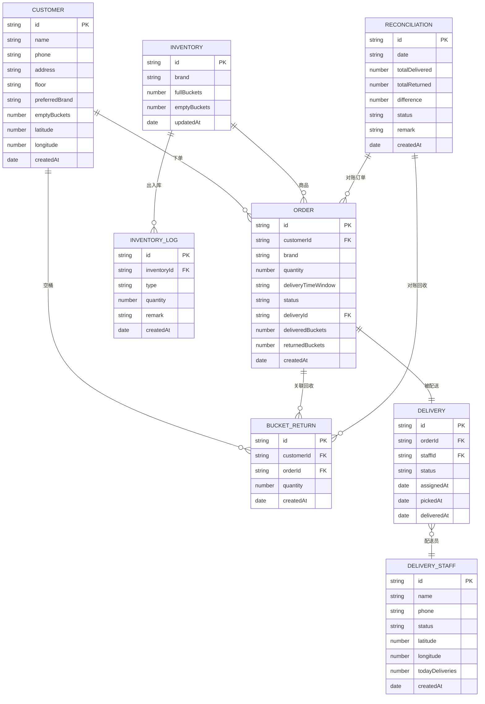

## 1. 架构设计

本系统为纯前端单页应用，使用 localStorage 进行数据持久化，无需后端服务。



## 2. 技术描述

- **前端框架**：React@18 + TypeScript
- **构建工具**：Vite@5
- **UI 组件库**：Ant Design@5
- **样式方案**：TailwindCSS@3
- **状态管理**：Zustand
- **路由管理**：React Router@6
- **数据可视化**：Recharts@2
- **图标库**：@ant-design/icons
- **数据持久化**：localStorage（封装为数据存储层）
- **表单处理**：Ant Design Form
- **日期处理**：dayjs

## 3. 目录结构

```
t:\zijie\66
├── .trae/
│   └── documents/
├── src/
│   ├── components/          # 公共组件
│   │   ├── Layout/          # 布局组件
│   │   ├── PageHeader/      # 页面头部
│   │   ├── StatusTag/       # 状态标签
│   │   └── Modal/           # 弹窗组件
│   ├── pages/               # 页面组件
│   │   ├── Dashboard/       # 工作台
│   │   ├── Customer/        # 客户管理
│   │   ├── Order/           # 订单管理
│   │   ├── Delivery/        # 配送管理
│   │   ├── Bucket/          # 空桶回收
│   │   ├── Inventory/       # 水桶资产
│   │   └── Reconciliation/  # 对账中心
│   ├── stores/              # 状态管理
│   │   ├── customerStore.ts
│   │   ├── orderStore.ts
│   │   ├── deliveryStore.ts
│   │   ├── bucketStore.ts
│   │   └── inventoryStore.ts
│   ├── types/               # TypeScript 类型定义
│   │   ├── index.ts
│   │   ├── customer.ts
│   │   ├── order.ts
│   │   ├── delivery.ts
│   │   ├── bucket.ts
│   │   └── inventory.ts
│   ├── utils/               # 工具函数
│   │   ├── storage.ts       # localStorage 封装
│   │   ├── distance.ts      # 距离计算（自动派单）
│   │   ├── date.ts          # 日期处理
│   │   ├── mockData.ts      # 模拟数据生成
│   │   └── id.ts            # ID 生成器
│   ├── hooks/               # 自定义 Hooks
│   │   ├── useAutoDispatch.ts  # 自动派单 Hook
│   │   └── useReconciliation.ts # 对账 Hook
│   ├── App.tsx
│   ├── main.tsx
│   └── index.css
├── index.html
├── package.json
├── vite.config.ts
├── tsconfig.json
└── tailwind.config.js
```

## 4. 路由定义

| 路由 | 页面 | 权限 |
|------|------|------|
| `/` | 工作台首页 | 全部角色 |
| `/customer` | 客户列表 | 管理员、接单员 |
| `/customer/new` | 新增客户 | 管理员、接单员 |
| `/customer/:id` | 客户详情 | 管理员、接单员 |
| `/order` | 订单列表 | 管理员、接单员 |
| `/order/new` | 新增订单 | 管理员、接单员 |
| `/order/:id` | 订单详情 | 全部角色 |
| `/delivery` | 配送管理 | 管理员 |
| `/delivery/my` | 我的配送 | 配送员 |
| `/bucket` | 空桶回收 | 管理员、配送员 |
| `/bucket/record` | 回收记录 | 管理员、配送员 |
| `/inventory` | 水桶资产 | 管理员、财务 |
| `/inventory/stock` | 库存管理 | 管理员、财务 |
| `/inventory/check` | 资产盘点 | 管理员、财务 |
| `/reconciliation` | 每日对账 | 管理员、财务 |
| `/reconciliation/history` | 对账历史 | 管理员、财务 |

## 5. 数据模型

### 5.1 实体关系图



### 5.2 数据初始化脚本

```typescript
// 初始化数据（首次加载时执行）
export const initializeData = () => {
  if (!storage.get('initialized')) {
    // 初始化客户数据
    storage.set('customers', [
      {
        id: generateId(),
        name: '张三',
        phone: '13800138001',
        address: '阳光小区1号楼2单元',
        floor: '501',
        preferredBrand: '农夫山泉',
        emptyBuckets: 3,
        latitude: 39.9042,
        longitude: 116.4074,
        createdAt: new Date().toISOString()
      },
      // ... 更多模拟数据
    ]);

    // 初始化配送员数据
    storage.set('deliveryStaffs', [
      {
        id: generateId(),
        name: '李配送',
        phone: '13900139001',
        status: 'idle',
        latitude: 39.9050,
        longitude: 116.4080,
        todayDeliveries: 0,
        createdAt: new Date().toISOString()
      },
      // ... 更多模拟数据
    ]);

    // 初始化库存数据
    storage.set('inventories', [
      {
        id: generateId(),
        brand: '农夫山泉',
        fullBuckets: 200,
        emptyBuckets: 150,
        updatedAt: new Date().toISOString()
      },
      // ... 更多品牌
    ]);

    storage.set('initialized', true);
  }
};
```

## 6. 核心算法

### 6.1 自动派单算法

```typescript
// 计算两点间距离（Haversine公式）
export const calculateDistance = (
  lat1: number, lon1: number, lat2: number, lon2: number
): number => {
  const R = 6371; // 地球半径（公里）
  const dLat = (lat2 - lat1) * Math.PI / 180;
  const dLon = (lon2 - lon1) * Math.PI / 180;
  const a = 
    Math.sin(dLat/2) * Math.sin(dLat/2) +
    Math.cos(lat1 * Math.PI / 180) * Math.cos(lat2 * Math.PI / 180) *
    Math.sin(dLon/2) * Math.sin(dLon/2);
  const c = 2 * Math.atan2(Math.sqrt(a), Math.sqrt(1-a));
  return R * c;
};

// 自动匹配最近配送员
export const findNearestDeliveryStaff = (
  customer: Customer,
  staffs: DeliveryStaff[]
): DeliveryStaff | null => {
  const availableStaffs = staffs.filter(s => s.status === 'idle');
  
  const staffWithDistance = availableStaffs.map(staff => ({
    staff,
    distance: calculateDistance(
      customer.latitude, customer.longitude,
      staff.latitude, staff.longitude
    )
  })).filter(item => item.distance <= 3); // 3公里内

  if (staffWithDistance.length === 0) return null;

  staffWithDistance.sort((a, b) => a.distance - b.distance);
  return staffWithDistance[0].staff;
};
```

### 6.2 每日对账算法

```typescript
export const generateDailyReconciliation = (date: string) => {
  const orders = getAllOrdersByDate(date);
  const returns = getAllReturnsByDate(date);
  
  const totalDelivered = orders.reduce((sum, order) => sum + order.quantity, 0);
  const totalReturned = returns.reduce((sum, ret) => sum + ret.quantity, 0);
  
  const difference = totalDelivered - totalReturned;
  
  return {
    id: generateId(),
    date,
    totalDelivered,
    totalReturned,
    difference,
    status: difference === 0 ? 'matched' : 'mismatch',
    createdAt: new Date().toISOString()
  };
};
```

## 7. 状态管理设计

使用 Zustand 进行状态管理，每个业务模块独立 store：

```typescript
// customerStore.ts
import { create } from 'zustand';
import { persist } from 'zustand/middleware';

interface CustomerState {
  customers: Customer[];
  addCustomer: (customer: Omit<Customer, 'id' | 'createdAt'>) => void;
  updateCustomer: (id: string, customer: Partial<Customer>) => void;
  deleteCustomer: (id: string) => void;
  getCustomer: (id: string) => Customer | undefined;
}

export const useCustomerStore = create<CustomerState>()(
  persist(
    (set, get) => ({
      customers: [],
      addCustomer: (customer) => {
        const newCustomer = {
          ...customer,
          id: generateId(),
          createdAt: new Date().toISOString()
        };
        set({ customers: [...get().customers, newCustomer] });
      },
      // ... 其他方法
    }),
    { name: 'customer-storage' }
  )
);
```
